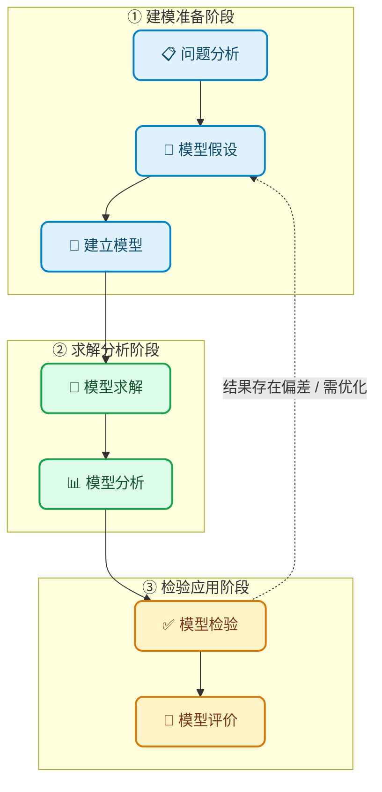

# 深入浅出：从“鸡兔同笼”看数学建模的本质

> **“以前做卷子的时候，叫人家应用题；现在落入大学苦海了，叫人家数学建模。”**

---

## 📌 引言

数学建模听起来似乎高深莫测，但它其实就是我们在中学阶段经常接触到的**应用题**。

在中学的数学课堂上，我们为了解答一道应用题而列出的方程，就是一个最基础的数学模型。两者的核心差异在于：

- **中学应用题**：背景单一、条件封闭、解题路径高度固定。
- **大学数学建模**：面向真实世界的复杂场景，需考虑的变量维度更多，解题思路也更加开放与多元。

简而言之：**数学建模就是将实际问题转化为数学语言，并利用数学工具进行求解与决策的全过程。**

---

## 💡 典型案例：鸡兔同笼问题

> [!TIP]
> **问题描述**
>
> 一个笼子里装有鸡和兔若干只，已知它们共有 **8 个头** 和 **22 只脚**，问该笼子中有多少只鸡和多少只兔？

### 问题求解

设笼中有鸡 $x$ 只，兔 $y$ 只，根据已知条件可列出以下二元一次方程组：

$$
\begin{cases}
x + y = 8 \\[1ex]
2x + 4y = 22
\end{cases}
$$

求解该方程组，得到：

$$
\begin{cases}
x = 5 \\
y = 3
\end{cases}
$$

**结论**：该笼子中有 **鸡 5 只，兔 3 只**。将此结果代入原题校验，结果完全正确。

---

## 🔬 建模步骤全解析

下面我们将上述解答过程拆解为数学建模的标准核心步骤：

### 1. 问题分析 (Problem Analysis)

拿到问题后，首要任务是明确背景与目标。本题的目标是求解**鸡与兔的具体数量**，已知量为**头的总数**与**脚的总数**。我们需建立已知量与未知量之间的数学关系。这是一道简单的应用题，我们只需要根据已知条件，列出方程组即可。实际问题往往是多样的、复杂的。在明确问题和建立模型时，**涉及的关键词，务必要查阅文献、资料弄懂其含义**，尽量弄清对象的主要特征,形成一个比较清晰的“问题”,由此初步确定用哪一类模型。数学建模的比赛的第一要义:**积极上网，积极请教**

> [!TIP]
>
> 学会调研是进行数学建模的第一步

### 2. 模型假设 (Model Assumptions)

一个实际问题往往会涉及很多因素，如果把涉及的所有因素都考虑到，既不可能也没必要，所以我们需要对问题进行简化，只考虑问题的本质，使问题更易解。

在鸡兔同笼问题中，我们觉得常识上存在畸形的兔或鸡的可能极小。所以我们假设不存在畸形的兔或鸡，将问题进一步简化。**模型的假设直接决定模型的好坏，所以在进行模型假设时一定要注意模型的假设是否合理、是否符合常识。**

> [!IMPORTANT]
> **💡 指导性建议：**
>
> - **抓大放小**：抓住主要因素，去掉无关或关系不大的因素，简化问题。
> - **合理限定**：对问题相关的方面做限定，便于解决问题。
> - **合理适度**：假设必须要合理、适度（带来的误差在实际问题可允许的误差范围内）。
> - **有的放矢**：假设是在解决问题的过程中，根据需要做出的，而不是凭空凑假设。

### 3. 符号说明 (Symbol Description)

在数学建模中，我们需要先对模型中的变量进行定义。**对在建模中使用到的符号都要进行简单准确的说明，否则会导致对模型的理解错误。** 对变量进行说明，是为了后续的数学建模和求解提供基础。

在本例中，我们定义 $x$ 为鸡的数量，$y$ 为兔的数量：

| 符号变量 | 物理/实际意义     | 约束条件             |
| :------: | :---------------- | :------------------- |
| **$x$**  | 笼中鸡的数量 (只) | $x \in \mathbb{N}^*$ |
| **$y$**  | 笼中兔的数量 (只) | $y \in \mathbb{N}^*$ |

### 4. 建立模型 (Model Construction)

在所做的假设基础上，用数学的语言、符号描述对象的内在规律，建立包含常量、变量等的数学模型。

> [!WARNING]
> **⚠️ 建模核心与原则**
> 这是数学建模最难的地方，每一道实际问题都需要根据实际情况建立模型。这不仅需要一些专业学科的知识、广阔的应用数学方面的知识，还需要丰富的想象力。
> **建模原则：尽量采用简单的数学工具，避免盲目使用复杂的数学工具。**

基于变量定义与系统等量关系，我们建立对应的代数方程组：

$$
\begin{cases}
x + y = 8 & \text{(头数约束)} \\[1ex]
2x + 4y = 22 & \text{(脚数约束)}
\end{cases}
$$

### 5. 模型求解与分析 (Model Solving & Analysis)

采用数学工具进行模型求解，对于复杂的问题可以借用计算机软件如 **MATLAB、Python** 等进行求解。

得到模型的解后，对求解结果进行数学上的分析，如：

- **误差分析** 与 **统计分析**
- 模型对数据的 **灵敏性分析**
- 对假设的 **强健性（鲁棒性）分析**

本例中选用简单的代入消元法或矩阵代数进行计算：

$$
\begin{bmatrix}
1 & 1 \\
2 & 4
\end{bmatrix}
\begin{bmatrix}
x \\
y
\end{bmatrix}
=
\begin{bmatrix}
8 \\
22
\end{bmatrix}
\implies
\begin{bmatrix}
x \\
y
\end{bmatrix}
=
\begin{bmatrix}
5 \\
3
\end{bmatrix}
$$

即计算得 $x = 5,\ y = 3$。因为本例是一个简单的线性方程组，所以直接求解即可，无需对模型进行复杂的分析。

### 6. 模型的验证 (Model Validation)

将求解和分析结果翻译回到实际问题，与实际的现象、数据比较，检验模型的合理性和适用性。**如果结果与实际不符，问题常常出在模型假设上，应该修改、补充假设，重新建模。**

本例中，将求得的解回代至真实场景中校验：

- **头部校验**：$5 + 3 = 8$ （符合）
- **脚部校验**：$2 \times 5 + 4 \times 3 = 22$ （符合）

验证通过，说明模型能够真实准确地反映并解决原问题。

---

## 🔄 数学建模的标准迭代流程

在实际应用中，数学建模通常是一个闭环迭代的过程：

### 各阶段要点

> [!IMPORTANT]
> **💡 要点：**
>
> 1.  **清晰定义问题**：明确建模的核心诉求，避免方向性偏差。
> 2.  **充分文献调研**：建模前需深入调查行业背景与理论基础。在明确问题与构建模型的过程中，对于涉及的所有核心概念、专有名词及专业术语，务必查阅权威文献资料，严谨厘清其精确的含义。
> 3.  **合理假设与建模**：模型假设直接决定模型的好坏，所以一定要注意模型的假设是否合理、是否符合常识。
> 4.  **符号说明**：对于模型中的变量必须进行详细的符号说明，确保模型的可读性和可理解性。

### 模型评价

一个优秀的数学模型，不仅要求求解正确，更需要在**全面性、创新性、平衡性、合理性与可检验性**五个维度上经得起推敲。以下是评价一个数学模型质量的核心标准：

| 序号 | 评价维度     | 具体要求                                                   |
| :--: | :----------- | :--------------------------------------------------------- |
|  1   | **全面考虑** | 对所给的问题有较全面的考虑，不遗漏关键因素与约束条件       |
|  2   | **创新建模** | 创造性地改造已有模型，或自创新的模型.                      |
|  3   | **平衡调和** | 模型的假设需要在合理与简化问题之间做出恰当的折中           |
|  4   | **结果分析** | 注重结果分析，考虑其在实际中的合理性，避免脱离实际的"      |
|  5   | **模型检验** | 善于对模型进行检验，通过多角度验证确保模型的可靠性与适用性 |

---

## 📋 总结归纳

通过“鸡兔同笼”这一经典案例，我们可以将数学建模的体系归纳如下：

| 步骤序号 | 核心阶段       | 主要任务                       | 案例体现                   |
| :------: | :------------- | :----------------------------- | :------------------------- |
|  **01**  | **问题分析**   | 明确背景、目标与约束条件       | 确定需求：求解鸡兔各自数量 |
|  **02**  | **模型假设**   | 忽略次要因素，合理简化现实     | 假设无畸形或特殊个体       |
|  **03**  | **符号说明**   | 准确定义模型中的变量与参数     | 设定变量 $x, y$ 代表数量   |
|  **04**  | **建立模型**   | 将业务逻辑转化为数学结构       | 构建二元一次方程组         |
|  **05**  | **求解与分析** | 运用算法/软件获取解并深度分析  | 求解得出 $x=5, y=3$        |
|  **06**  | **模型验证**   | 评估解的合理性，不符则重构假设 | 回代校验方程及现实逻辑     |
