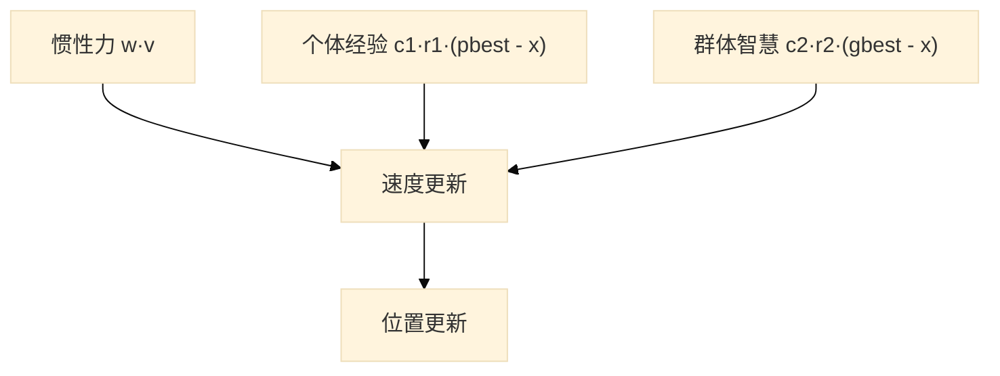

## 算法核心思想 🐦

粒子群优化算法（PSO）是一种种群随机搜索算法，其灵感来源于鸟群觅食的行为。由于PSO算法原理简单、易实现的特点，在众多领域中有着非常多的应用。

### 粒子的"思考"逻辑 🧠

在求解最优解前，我们随机将N个粒子撒到解空间中，每个粒子代表解空间中的一个可能的最优解，它在每次迭代中通过更新**位置**和**速度**来前往下一个位置。粒子的决定受到三个维度的力量牵引：

| 牵引力       | 含义                                      | 作用         |
| :----------- | :---------------------------------------- | :----------- |
| **惯性**     | 保持之前的运动方向（过去的惯性速度 $v$）  | 维持飞行趋势 |
| **个体经验** | 飞向自身历史找到的最佳位置（$pbest$）     | 自我思考     |
| **群体智慧** | 飞向整个种群历史找到的最佳位置（$gbest$） | 从众效应     |



### 位置与速度更新公式

$$v_{i}^{(t+1)} = w \cdot v_{i}^{(t)} + c_1 \cdot r_1 \cdot (pbest_i - x_i^{(t)}) + c_2 \cdot r_2 \cdot (gbest - x_i^{(t)})$$

$$x_{i}^{(t+1)} = x_i^{(t)} + v_{i}^{(t+1)}$$

**参数含义：**

| 参数       | 说明                      | 直观理解                                                               |
| :--------- | :------------------------ | :--------------------------------------------------------------------- |
| $w$        | **惯性权重**，            | 决定探索能力 ，$w$ 大 → 运动能力强；$w$ 小 → 粒子运动趋于平缓          |
| $c_1, c_2$ | **学习因子**              | $c_1$ 决定个体经验偏向（自我思考）；$c_2$ 决定群体经验偏向（从众效应） |
| $r_1, r_2$ | $[0, 1]$ 之间的**随机数** | 增加算法的随机探索性                                                   |

---

> [!IMPORTANT]
> **流程总结**
>
> **初始化 → 速度/位置更新 → 评估 → 更新 $pbest$ / $gbest$ → 循环迭代直至满足终止条件**

### 优点与局限性 ⚖️

#### ✅ 优点

| 优点                    | 说明                                                     |
| :---------------------- | :------------------------------------------------------- |
| 🚀 **收敛速度快**       | 通过直接追踪 $gbest$，粒子能迅速聚集到优质区域           |
| 🧩 **参数简单**         | 相比遗传算法等，没有复杂的交叉和变异逻辑，易于编码实现   |
| 🎯 **非常适合连续优化** | 特别适合连续数值空间的求极值问题（如函数优化、参数拟合） |

### ⚠️ 局限性（早熟收敛 Trap）

> [!WARNING]
> **易陷入局部最优**
>
> 所有粒子紧跟着最优粒子运作降低了粒子的多样性了和全局搜索能力。

---

## MATLAB 工具箱 `particleswarm` 🧰

MATLAB **全局优化工具箱（Global Optimization Toolbox）** 内置了官方实现的粒子群函数 `particleswarm`，使用方便。

### 基本语法

```matlab
x         = particleswarm(fun, nvars, lb, ub);            % 最简形式
[x, fval] = particleswarm(fun, nvars, lb, ub);            % 同时返回最优值
[x, fval, exitflag, output] = particleswarm(fun, nvars, lb, ub, options);
```

| 参数       | 说明                                                          |
| :--------- | :------------------------------------------------------------ |
| `fun`      | 目标函数句柄（最小化），必须接受**行向量**输入并返回标量      |
| `nvars`    | 决策变量个数（即粒子维度）                                    |
| `lb`, `ub` | 指定为实数向量或双精度数组                                    |
| `options`  | 由 `optimoptions('particleswarm', ...)` 生成的选项结构体      |
| `exitflag` | 退出标志：`1` 正常收敛、`0` 达到最大迭代、`-2` 无效输入等     |
| `output`   | 结构体：实际迭代次数、收敛曲线（`output.bestfval`）等详细信息 |

### 常用 options 选项

```matlab
options = optimoptions('particleswarm', ...
    'SwarmSize', 50, ...                % 种群规模 N（默认 min(100, 10*nvars)）
    'MaxIterations', 200, ...           % 最大迭代次数
    'MaxStallIterations', 20, ...       % 停滞代数：连续 20 代无改进即提前终止
    'InertiaRange', [0.4, 0.9], ...     % 惯性权重范围
    'SelfAdjustmentWeight', 1.49, ...   % 个体学习因子 c1
    'SocialAdjustmentWeight', 1.49, ... % 群体学习因子 c2
    'Display', 'iter', ...              % 命令行实时输出每代信息
    'PlotFcn', 'pswplotbestf');         % 实时绘制最优值收敛曲线
```

---

## 经典 benchmark 测试函数

我们从23个经典基础测试集选择四个进行对比实验：

**Sphere**

- **数学原理**：$f(x)=\sum_{i=1}^{n}x_i^2$
- **全局最优**：$0$
- **搜索范围**：$[-100, 100]^n$

**Rosenbrock**

- **数学原理**：$f(x)=\sum_{i=1}^{n-1}\left[100(x_{i+1}-x_i^2)^2+(x_i-1)^2\right]$
- **全局最优**：$0$
- **搜索范围**：$[-30, 30]^n$

**Rastrigin**

- **数学原理**：$f(x)=\sum_{i=1}^{n}\left[x_i^2-10\cos(2\pi x_i)\right]+10n$
- **全局最优**：$0$
- **搜索范围**：$[-5.12, 5.12]^n$

**Ackley**

- **数学原理**：$f(x)=-20e^{-0.2\sqrt{\frac{1}{n}\sum x_i^2}}-e^{\frac{1}{n}\sum \cos(2\pi x_i)}+20+e$
- **全局最优**：$0$
- **搜索范围**：$[-32, 32]^n$

> [!NOTE]
> **横向对比结论**
>
> - **Sphere** 最简单：检验算法的**收敛速度**；
> - **Rosenbrock** 在最优解附近平坦，检验算法在算法后期逃离平暖地带的能力；
> - **Rastrigin** 密布局部最优：检验算法寻找全局最优解的能力；
> - **Ackley** 在外部平坦区域，在接近最优解陡峭，检验算法前期逃离平缓地带的能力


## 惯性权重 $w$ 对性能的影响

为验证惯性权重 $w$ 对算法收敛性能的影响，我们设计如下对比实验：

- **实验变量**：惯性权重 $w$ 分别取 **0.4** 与 **0.8** 两组进行对比；
- **初始种群**：在搜索空间内随机选取 20 个粒子作为初始种群，所有粒子的初始位置与初始速度均随机生成；
- **实验规模**：对每个测试函数独立重复 **20 次**实验，每次实验的迭代次数为 **20000**；
- **固定参数**：学习因子取 $c_1 = c_2 = 1.49445$。

每次迭代中计算每个粒子的适应度值，并从**收敛速度**与**收敛效果**两方面评价算法性能：

1. **收敛速度**：记录单次实验每一代的最优适应度，再对 20 次实验取平均，绘制**对数平均适应度与迭代次数的关系曲线**，直观比较不同 $w$ 下收敛的快慢；
2. **收敛效果**：统计 20 次实验最终最优适应度的**均值与方差**，用以衡量解的精度与稳定性。

### 实验结果

#### 低维sphere

这里我们取sphere 的维数为5维，用来区别不同惯性权重 $w$ 对 sphere 函数的收敛性能的影响


| 惯性权重 $w$ | 最小值   | 平均值           | 方差     |
| :----------- | :------- | :--------------- | :------- |
| 0.4          | 0.000000 | $1.32*10^{-101}$ | 0.000000 |
| 0.8          | 0.000000 | 0.000000         | 0.000000 |

从上面的图片和表格可以看出，在面对sphere函数这种简单的单峰函数时，当 $w=0.4$ 时，算法的收敛速度更快；当 $w=0.8$ 时，算法的收敛速度更慢，而且不同 $w$ 都能得到较好的收敛效果。

#### rastrigin 函数

这里我们取rastrigin 的维数为5维，用来区别不同惯性权重 $w$ 对 rastrigin 函数的收敛性能的影响


| 惯性权重 $w$ | 最小值   | 平均值  | 方差   |
| :----------- | :------- | :------ | :----- |
| 0.4          | 0.000000 | 0.00610 | 0.2477 |
| 0.8          | 0.000000 | 0.00079 | 0.0329 |

从上面的图片和表格可以看出，在面对rastrigin函数这种充满局部最优解的函数时，当 $w=0.4$ 时，算法的收敛速度虽然更快，但是收敛效果更差；当 $w=0.8$ 时，算法的收敛速度更慢，但是收敛效果更好。

#### ackley 函数

这里我们取ackley 的维数为50维,用来区别不同惯性权重 $w$ 对 ackley 函数的收敛性能的影响


| 惯性权重 $w$ | 最小值   | 平均值 | 方差  |
| :----------- | :------- | :----- | :---- |
| 0.4          | 0.000000 | 0.02   | 0.63  |
| 0.8          | 0.000000 | 0.0051 | 0.177 |

从上面的图片和表格可以看出，在面对ackley函数这种外部平坦区域，在接近最优解陡峭的函数时，当 $w=0.4$ 时，算法很难收敛到一个较好的解，而当 $w=0.8$ 时，虽然算法的收敛速度更慢，但是收敛效果更好。

#### Rosenbrock 函数

这里我们取Rosenbrock 的维数为5维,用来区别不同惯性权重 $w$ 对 Rosenbrock 函数的收敛性能的影响


| 惯性权重 $w$ | 最小值   | 平均值           | 方差    |
| :----------- | :------- | :--------------- | :------ |
| 0.4          | 0.000000 | 4.709            | 636.778 |
| 0.8          | 0.000000 | 18.0028546182288 | 1272.72 |

从上面的图片和表格可以看出，在面对Rosenbrock函数这种最优解附近地势平缓的函数时，$w=0.8$ 时，算法很难收敛，并且计算出的最优解误差非常大，当 $w=0.4$ 时，算法可以收敛到一个更好的结果上。

### 实验结论

对于惯性系数 $w$，在算法的初始阶段我们应该选取更大的 $w$，以确保粒子在搜索空间内快速移动，避免陷入局部最优解和外围地势平缓的地带；在算法的后期阶段，我们应该选取较小的 $w$，提高收敛的速度，同时增加算法逃离最优解附近的平缓地带的能力。

## 参数调节策略 🎛️

标准 PSO 只有 3 个核心参数（$w, c_1, c_2$），根据上面的实验，我们介绍几种常用的调参方式。

### 8.1 惯性权重 $w$ 的递减策略

**线性递减 (LDIW)**

- **公式**：$w(t) = w_{max} - (w_{max} - w_{min}) \cdot \frac{t}{T}$
- **特点**：最经典，前期探索后期开发，默认首选

**非线性递减**

- **公式**：$w(t) = w_{min} + (w_{max} - w_{min}) \cdot e^{-k \cdot t/T}$
- **特点**：前期快速下降，适合快速聚焦

**随机权重**

- **公式**：$w(t) = 0.5 + \dfrac{\text{rand}}{2}$
- **特点**：增强多样性，避免陷入固定模式

> [!NOTE]
> **经验取值**：$w_{max}=0.9$，$w_{min}=0.4$，$T$ 为最大迭代次数。

### 8.2 学习因子 $c_1, c_2$ 的时变策略

- **传统取值**：$c_1=c_2=2.0$；快速向最优解靠拢
- **同步收缩**：$c_1 = c_2 = 1.49445$；慢速向最优解靠拢
- **异步时变**：早期 $c_1$ 大（多自我探索），后期 $c_2$ 大（多群体跟随）：

$$c_1(t) = c_{1,max} - (c_{1,max}-c_{1,min})\frac{t}{T}, \quad c_2(t) = c_{2,min} + (c_{2,max}-c_{2,min})\frac{t}{T}$$

### 8.3 Clerc 收缩因子模型

Clerc 提出引入**收缩因子 $\chi$**，从理论上保证了粒子轨迹收敛：

$$v_{i}^{(t+1)} = \chi \left[ v_{i}^{(t)} + c_1 \cdot r_1 \cdot (pbest_i - x_i) + c_2 \cdot r_2 \cdot (gbest - x_i) \right]$$

$$\chi = \frac{2}{\left| 2 - c - \sqrt{c^2 - 4c} \right|}, \quad c = c_1 + c_2 > 4$$

**推荐参数**：$c_1 = c_2 = 2.05 \Rightarrow c = 4.1$，则 $\chi \approx 0.7298$。此时**无需单独限制 $v_{max}$**，粒子轨迹理论上有界，收敛性有保证。
**模型优势**

- **无需速度边界限制**：传统 PSO 常需手动限制粒子的最大速度 $v_{max}$，防止粒子飞出边界；引入收缩因子后，速度会被自动收缩，无需依赖极端的速度截断。
- **保证理论收敛性**：数学上证明了在不使用 $v_{max}$ 的情况下，粒子轨迹能够稳定收敛于搜索空间中的优质区域。
- **控制探索与开发平衡**：有时会在 $\chi$ 前加入参数 $k \in (0, 1]$（即 $v \leftarrow k \cdot \chi \cdot \dots$），当 $k \approx 1$ 时搜索能力强，收敛较慢；$k \to 0$ 时局部开发能力强，能加快收敛。
