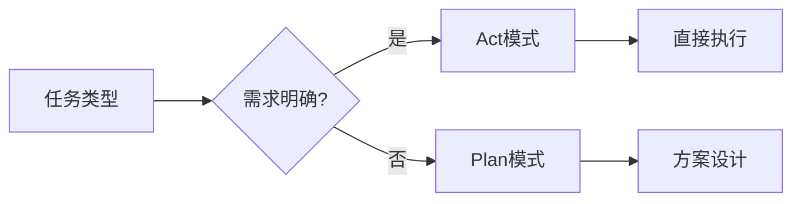

# 数学建模完整指南

## 一、Cline 深度使用技巧

### 1.1 模式选择策略



### 1.2 数学建模专用指令模板

```markdown
请用 MATLAB 实现[模型类型]模型，要求：

1. 输入：[数据描述]
2. 处理：[算法要求]
3. 输出：[结果格式]
4. 约束：[限制条件]
```

## 二、数学表达规范

### 2.1 LaTeX 公式大全

| 类型     | 语法示例                               | 说明         |
| -------- | -------------------------------------- | ------------ |
| 积分     | `$\int_a^b f(x)dx$`                    | 定积分       |
| 矩阵     | `$\begin{matrix}1&2\\3&4\end{matrix}$` | 2x2 矩阵     |
| 希腊字母 | `$\alpha, \beta, \gamma$`              | 常用希腊字母 |

### 2.2 自然语言转公式技巧

```
描述：实现二次函数f(x)=ax²+bx+c的极值求解
转换：$$x_{ext} = -\frac{b}{2a}$$
```

## 三、多目标优化专题

### 3.1 生产计划案例详解

```matlab
%% 多目标权重配置
w1 = 0.6; % 利润权重
w2 = 0.2; % 污染权重
w3 = 0.2; % 设备利用权重

%% 帕累托前沿分析
pareto_front = [];
for w1 = linspace(0,1,10)
    [x, fval] = linprog(w1*f1 + (1-w1)*f2, A, b);
    pareto_front = [pareto_front; [x', fval]];
end
```

### 3.2 灵敏度分析代码

```matlab
% 参数敏感性测试
param_range = linspace(0.1, 0.9, 20);
results = arrayfun(@(p) {
    [x, fval] = linprog(p*f1 + (1-p)*f2, A, b);
    [x(1), x(2), fval]
}, param_range);
```

## 四、建模全流程模板

### 4.1 标准工作流

1. **问题定义阶段**

   - 使用 Plan 模式明确：

   ```markdown
   目标：[量化指标]
   约束：[资源限制]
   数据：[来源/格式]
   ```

2. **模型实现阶段**

   ```matlab
   % Act模式生成代码框架
   function [output] = model_template(input)
       % 预处理
       data = preprocess(input);

       % 核心算法
       result = core_algorithm(data);

       % 后处理
       output = postprocess(result);
   end
   ```

## 五、高级技巧

### 5.1 性能优化方案

```matlab
% 并行计算加速
parfor i = 1:100
    results(i) = simulate_model(params(i));
end

% 内存优化
data = memmapfile('large_data.bin');
```

### 5.2 自动化报告生成

````markdown
# 建模报告模板

## 1. 问题描述

{{problem_statement}}

## 2. 模型结构

```mermaid
{{model_diagram}}
```
````

## 3. 结果分析

{{analysis_results}}

```

## 六、常见问题解决方案
| 问题类型       | 解决方法                     |
|----------------|------------------------------|
| 收敛速度慢     | 调整学习率/初始化参数        |
| 过拟合         | 增加正则化/交叉验证          |
| 结果不稳定     | 多次运行取平均/随机种子固定  |

## 七、资源推荐
1. **MATLAB工具包**
   - Optimization Toolbox
   - Global Optimization Toolbox
   - Parallel Computing Toolbox

2. **参考书籍**
   - 《数学建模算法与应用》
   - 《MATLAB数学建模经典案例》
```
